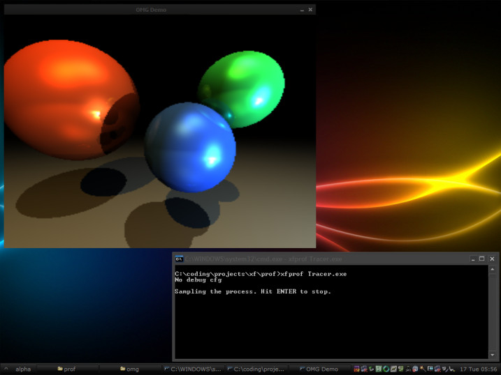
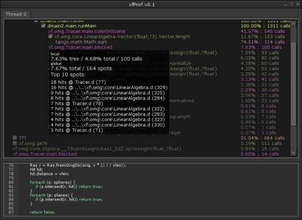
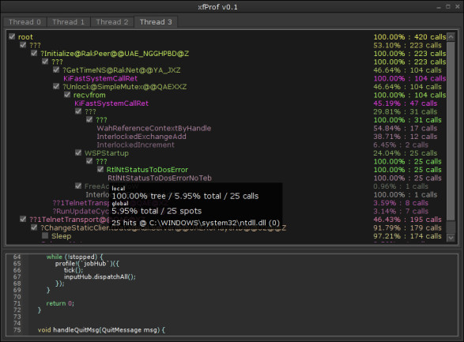

Overview
========

**xfProf** is a non-intrusive multi-thread statistical profiler for the D programming language, currently supporting *DMD-Win*. It’s largely inspired by the `Sleepy profiler <http://sleepy.sourceforge.net/>`__ which unfortunately doesn’t understand the debug info produced by DMD, nor the D name mangling. Quoting Nick Chapman, the author of Sleepy, *"Every 1ms or so, the profiler thread suspends the target thread, and pulls out the current instruction pointer register value from the thread context. These mem addresses are resolved into procedure names and line numbers using debug information. This allows line-level resolution, without making any changes to the target program."*

This profiling method has the additional advantage of being very light-weight. If the program is sampled only a few hundred (or thousand) times per second, the performance overhead will not be noticeable. What it means is that soft real-time applications (such as games) may be profiled in their normal working conditions.

Features
========

**xfProf** is still very much work-in-progress, with target features such as real-time profiling info updates, data export and various sorting and browsing methods. Currently it can display a call tree with the counts that the program was found in a particular function and the percentage of times it was there. Moving the mouse cursor over an item in the call tree will also show the 10 most frequently discovered spots in that particular function.

Download
========

A Compiled version of **xfProf** can be found `here <xfProf.7z>`__.
The sources are available in a `mercurial repository <http://team0xf.com:1024/prof/>`__.

Usage
=====

The program to be profiled must be compiled with debug info ( with -g ) and should be compiled without optimizations ( without -O ). If optimizations are enabled, it will be impossible for **xfProf** to trace the call stack, thus it will be flattened.

    *Note: if you use a tool such as ReBuild, `xfBuild <http://bitbucket.org/h3r3tic/xfbuild/>`__ or Bu[il]d, please remember to use -full if you change compilation options*

Start the program you wish to profile and then launch **xfProf** with the program’s name as a parameter. For example:

**xfProf** MyProgram.exe

    *Note: The program name is case sensitive*

Use the program normally with the behavior you’d like to profile. Give at least 5 CPU seconds to it so the results may be meaningful.

When you think you’ve generated enough data to profile with, switch back to the **xfProf** console and hit Enter. *Terminating the profiled program before hitting Enter in **xfProf** will currently crash the profiler.*

Wait a few seconds so the profiling data is analyzed, then explore the call tree. Right click on an item in the tree to view the source code for its top spot.

**xfProf** allows access to the profiling data of every thread in the program via thread tabs:

Misc
====

**xfProf** uses the `Hybrid GUI library <http://hybrid.team0xf.com/>`__.

