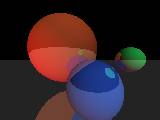
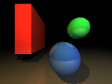
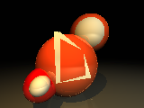

What ?
======

ctrace is a compile-time raytracer written in the D Programming Language.

Why ?
=====

Why would anyone create anything like this ? The rendering times are terrible, code is harder to write... but I think it's a nice demonstration of metaprogramming in D.
Ok, ok, I'm just a pervert and I love raping the D compiler.

How ?
=====

Anyway, how does it work ? The compiler doesn't produce an executable but spits out BGR pixel data instead. The whole idea is to compute the image using compile-time constructs only - lots of templates. Then the data is printed using 'pragma (msg, theData)'. There's one problem though - the memory requirements for generating even the simplest image are so high that it'd be impossible to create anything meaningful. The compiler doesn't just 'run' templates - it saves their symbols somewhere and looks them up when doing subsequent instantiations. This is why I'm using a program that runs the compile-time raytracing for short spans of pixels. It then reads the data the compiler prints and generates the final image by concatenating the output of several compilations.

You can `download ctrace <http://h3.gd/ctrace/ctrace.zip>`_ and give it a try. Just run 'rdmd ctrun.d'. The resolution is defined in ctrun.d, scene description sits in ctrace.d.

Note: ctrace was developed when D didn't have Compile Time Function Evaluation and uses only the functional sub-language of template metaprogramming. Using CTFE, ctrace could be made hundreds of times faster and look like normal runtime code. But then it wouldn't be fun anymore.

Here are some sample images generated by ctrace that I saved during its development
-----------------------------------------------------------------------------------

.. image:: first%20attempts.png
    :width: 320
    :height: 240

One of the very first attempts of compile-time raytracing

.. image:: first%20bugs.png
    :width: 320
    :height: 240

I added support for colored materials, but it turned out that my ray-sphere intersection code was producing incorrect surface normals. The image above was supposed to have one directional light aimed at [0, 0, -1]

.. image:: bugs%20fixed.png
    :width: 320
    :height: 240

Slightly different scene with one main white light and a red backlight. Sphere intersection bugs fixed.

Now with a ground plane and reflections

.. image:: better%20lighting.png
    :width: 320
    :height: 240

features += boxes | shadows | pointLights; 
the raytracing wasn't fully recursive at that point, so reflections are a bit bogus

Now with fully-recursive raytracing with depth set to 3

Added triangle support and traced a D logo. Somehow there are some incorrect pixels

And now, for the real thing...
------------------------------

.. image:: big%20one.png
    :target: big%20one.png

Total rendering/compilation time: 26148 seconds (on my 1.7GHz laptop)

::

    alias Tuple!(
            Sphere!(Vec3!(-4.f, 1.5f, -8.f),    3.2f,  Vec3!(1.f, .3f, .1f)),
            Sphere!(Vec3!(2.5f,  1.5f, -5.0f),  1.2f,  Vec3!(.2f, 1.f, .4f)),
            Sphere!(Vec3!( .7f, -1.5f, -4.2f),  1.5f,  Vec3!(.2f, .4f, 1.f)),
            Plane! (Vec3!( 0.f,  1.f,   0.f),   4.f,   Vec3!(.5f, .5f, .5f))
    ) scene;

    alias Tuple!(
            PointLight!(Vec3!(8.f, 8.f, 10.f), scale!(Vec3!(0.7f, 0.7f, 0.6f), 30.f)),
            PointLight!(Vec3!(-2.f,  2.5f, 0.f), scale!(Vec3!(.6f, .4f, .1f), 8.f))
    ) lights;

